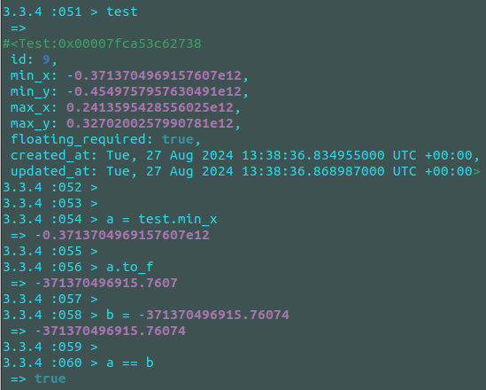

# Системные требования
```
ruby 3.3.4
rails >= 7.0.8.4
PostgreSQL (не ниже 12, лучше 14 и выше)
```

# Разворот проекта (на примере Unix-систем)
```
В папке проекта выполнить в терминале следующие команды:
bundle install

sudo -u postgres psql  (перейти под юзера postgres и запустить консоль PostgreSQL)

(либо использовать другой способ по своему усмотрению)

В открывшейся консоли PostgreSQL выполнить:
CREATE ROLE elecard_contest WITH LOGIN PASSWORD 'elecard_contest';
ALTER USER elecard_contest CREATEDB;
CREATE DATABASE elecard_contest_development OWNER elecard_contest; (опционально)

далее нужно выйти, нажав ctrl + D


В папке проекта выполнить:
rails db:create (опционально. Нужно только если не была выполнена предыдущая команда на создание БД)
rails db:migrate
```

## Запуск проекта
```
Запуск проекта не требуется
```

## Выполнение команд по сути задания:
```
1. Скачиваем данные для "анализа"
rake elecard_api:fetch_and_populate_test_data

Данные ложатся в БД, модели Test и Circle

2. Проверяем получившиеся результаты:
rake elecard_api:check_calculations

На текущий момент удалось добиться результата:

Response code: 200
{"result":[true,true,true,true,true,true,true,true,false]}

Это связано с тем, что при переводе из Decimal во Float (методом .to_f) теряется, как минимум, одна цифра после запятой!
Условно это можно назвать багом Rails (ActiveRecord)...

Возможно, в другой ветке задача будет выполнена без задействования Rails и БД, и в моменте таких ошибок удастся избежать.

```


